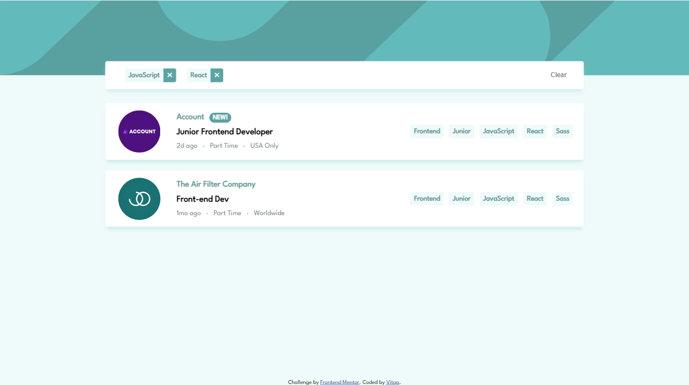
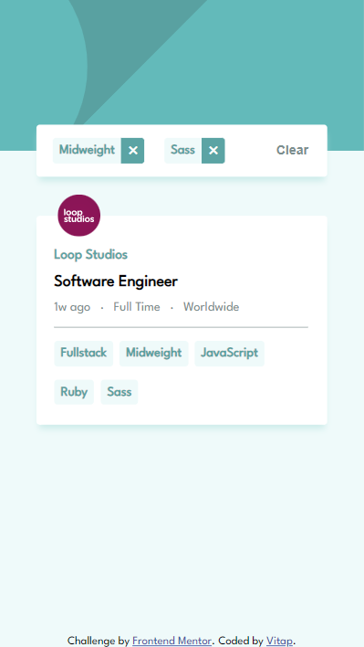

# Frontend Mentor - Job listings with filtering solution

This is a solution to the [Job listings with filtering challenge on Frontend Mentor](https://www.frontendmentor.io/challenges/job-listings-with-filtering-ivstIPCt). Frontend Mentor challenges help you improve your coding skills by building realistic projects.

## Table of contents

- [Frontend Mentor - Job listings with filtering solution](#frontend-mentor---job-listings-with-filtering-solution)
  - [Table of contents](#table-of-contents)
  - [Overview](#overview)
    - [The challenge](#the-challenge)
    - [Screenshot](#screenshot)
    - [Links](#links)
  - [My process](#my-process)
    - [Built with](#built-with)
    - [What I learned](#what-i-learned)
    - [Continued development](#continued-development)
    - [Useful resources](#useful-resources)
  - [Author](#author)

## Overview

### The challenge

Users should be able to:

- View the optimal layout for the site depending on their device's screen size
- See hover states for all interactive elements on the page
- Filter job listings based on the categories

### Screenshot

<figure align="center">
  
  <figcaption>
    <b>Fig.1 - Desktop Screenshot</b>
  </figcaption>
</figure>

<figure align="center">
  
  <figcaption>
    <b>Fig.2 - Mobile Screenshot</b>
  </figcaption>
</figure>

### Links

- Solution URL: [my solution](https://www.frontendmentor.io/solutions/job-listings-with-filtering-jG2sMVN7cW)

- Live Site URL: [static-job-listings](https://static-job-listings-master-roan.vercel.app/)

## My process

### Built with

- Semantic HTML5 markup
- CSS custom properties
- Flexbox
- Sass

### What I learned

- Implement `justify-self:xxx;` effect with `margin-${direction}:auto`

```css
.attribution {
  margin-top: auto;
}
```

- Add horizontal line using CSS

```css
&::before {
  content: " ";
  width: 100%;
  height: 0.5px;
  background-color: $light-gray;
}
```

- Use spread operator in append()

```js
const jobs = data.map((_) => jobItem(_));
const list = document.querySelector(".job-list");

list.append(...jobs);
```

### Continued development

- Apply React.js in my future solutions. ( Vanilla JS is great but...)

### Useful resources

- [Center text (horizontally and vertically) inside a div block](https://stackoverflow.com/a/5703632)
- [No justify-self in Flexbox? No problem!](https://www.youtube.com/watch?v=q08BbYNG8h0) - This teached me to use `margin-left(or right):auto;` to implement like `justify-self` in Flexbox. 👍
- [One-Sided Box-Shadows with CSS](https://pixelbrewco.com/index.php?step=blog&step2=post10)
- [How to increase the duration of :active in css](https://stackoverflow.com/questions/30939950/how-to-increase-the-duration-of-active-in-css)
- [How to insert a line break before an element using CSS](https://stackoverflow.com/a/11750985)
- [border radius](https://developer.mozilla.org/zh-CN/docs/Web/CSS/border-radius)

## Author

- Github - [Vitap](https://github.com/Vitap7)
- Frontend Mentor - [@Vitap7](https://www.frontendmentor.io/profile/Vitap7)
